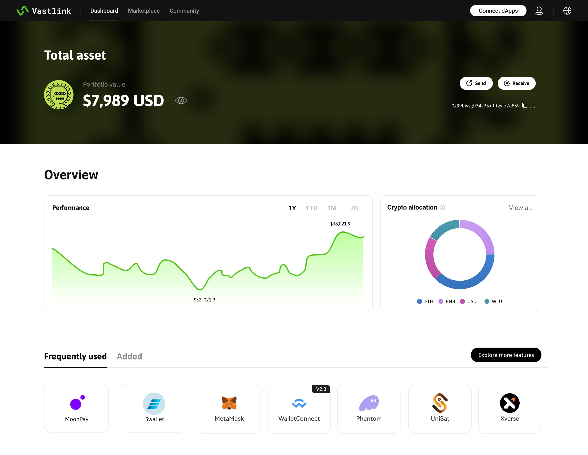

# Assets Management

The main functions of Vastlink in asset management include but are not limited to:&#x20;

* Cross-border B2B payments
* KYC & KYB&#x20;
* On-ramp and off-ramp
* Multisig&#x20;
* Branding and customization
* Earning

<figure><figcaption>
The Dashboard of the POC version
</figcaption></figure>


More features can be found and installed in the marketplace.

