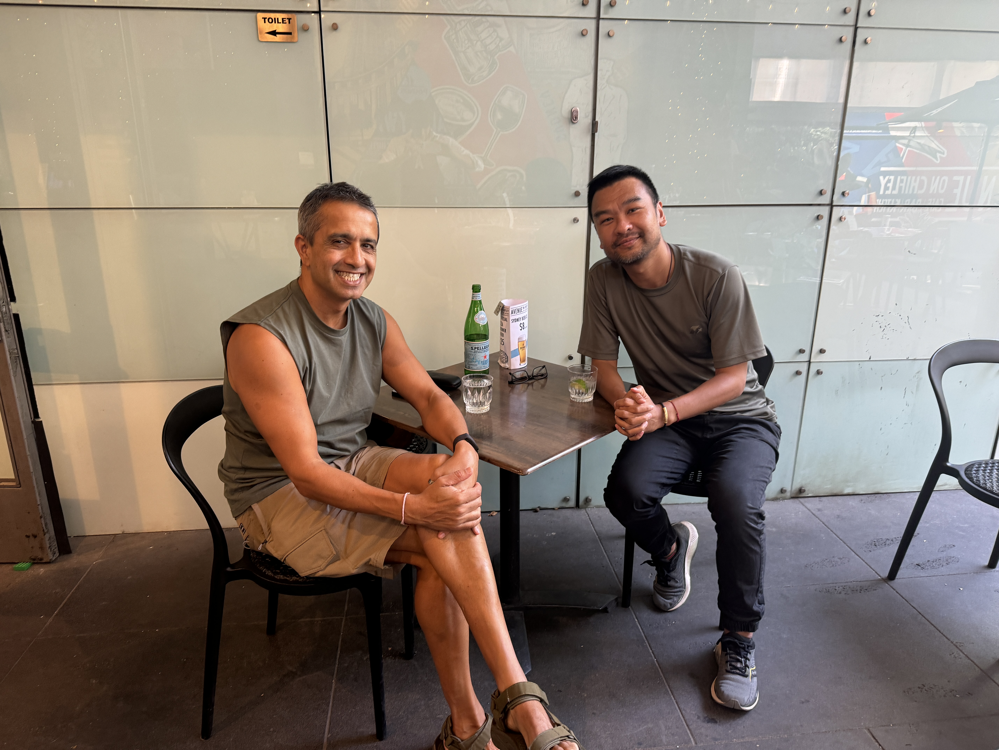
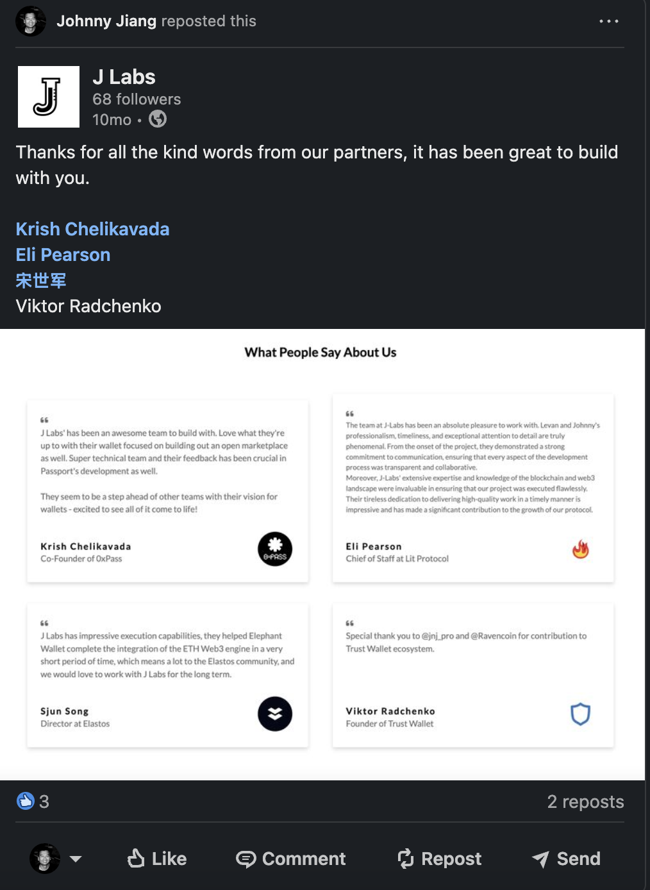

# Our Backers

## **Advisors**

<figure><figcaption>
<a href="https://www.linkedin.com/in/zhixiong-pan-57839122/"> <strong>Zhixiong Pan</strong></a>
</figcaption></figure>

* Crypto Evangelist
* Co-Founder at ChainFeeds
* Ex Director of Research at ChainNews

<figure><figcaption>
<a href="https://www.discogs.com/artist/496195-David-Allen-Jones">David Allen Jones</a>
</figcaption></figure>

* Crypto savvy mentor and advisor
* R\&B song writer and producer in Hollywood, worked with Michael Jackson, Bon Jovi, Elton John, just name a few

<figure><figcaption>
<a href="https://www.linkedin.com/in/devenbillimoria/">Deven Billimoria</a>
</figcaption></figure>

* Ex-CEO of Smartgroup (ASX:SIQ)
* Investor and advisor

***

## Infrastructure partners

Lit Protocol is the decentralized network for managing keys and secrets

<figure><figcaption>
<a href="https://www.litprotocol.com/">Lit Protocol</a>
</figcaption></figure>

Humanity’s first blind computer&#x20;

<figure><figcaption>
<a href="https://nillion.com/"><strong>Nillion</strong></a>
</figcaption></figure>

The zero trust interoperability platform

<figure><figcaption>
<a href="https://ika.xyz/"><strong>Ika</strong></a>
</figcaption></figure>

A global KYC/AML and fraud ecosystem&#x20;

<figure><figcaption>
<a href="https://frankieone.com/"><strong>FrankieOne</strong></a>
</figcaption></figure>

***

## Testimonials

<figure><figcaption></figcaption></figure>


[J Labs](https://j-labs.xyz/) is a Web3 development shop founded by Johnny Jiang, it is the driving force for building Vastlink.

