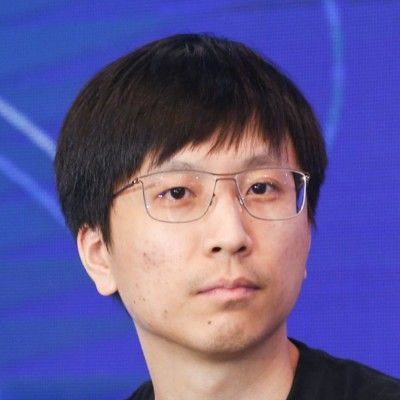
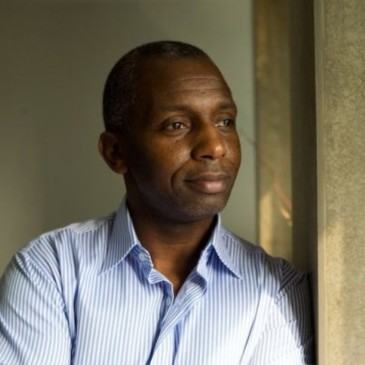
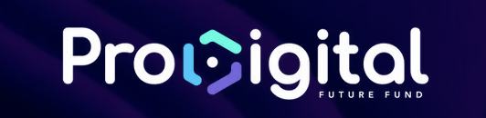
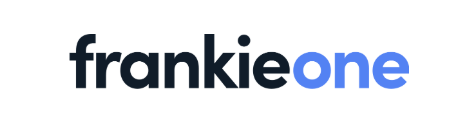
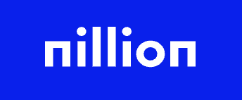
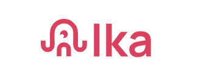

# Our Backers

## **Advisors**

<figure><figcaption>
<a href="https://www.linkedin.com/in/zhixiong-pan-57839122/"> <strong>Zhixiong Pan</strong></a>
</figcaption></figure>

* Crypto Evangelist
* Co-Founder at ChainFeeds
* Ex Director of Research at ChainNews

<figure><figcaption>
<a href="https://www.discogs.com/artist/496195-David-Allen-Jones">David Allen Jones</a>
</figcaption></figure>

* Crypto savvy mentor and advisor
* R\&B song writer and producer in Hollywood, worked with Michael Jackson, Bon Jovi, Elton John, just name a few

***

## Investors

<figure><figcaption>
<a href="https://www.prodigitalfund.com/"><strong>ProDigital Future Fund</strong></a>
</figcaption></figure>

A leading venture capital firm dedicated to empowering now is future web3/crypto entrepreneurs worldwide. Our mission is to fuel the next wave of digital revolution by supporting visionary entrepreneurs, fostering global impact, and leveraging our extensive network and resources. ProDigital Future Fund aims to shape the future of internet and unlock a more interconnected, secure, and equitable digital world.

***

## Partners

<figure><figcaption>
<a href="https://frankieone.com/"><strong>FrankieOne</strong></a>
</figcaption></figure>

A global KYC/AML and fraud ecosystem&#x20;

<figure><figcaption>
<a href="https://nillion.com/"><strong>Nillion</strong></a>
</figcaption></figure>

Humanity’s first blind computer&#x20;

<figure><figcaption>
<a href="https://ika.xyz/"><strong>Ika</strong></a>
</figcaption></figure>

The zero trust interoperability platform&#x20;


We will update here when new advisors, investors and partners join.

