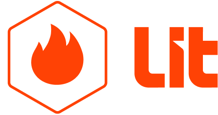
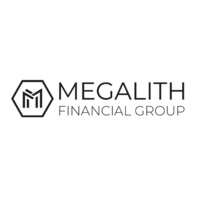
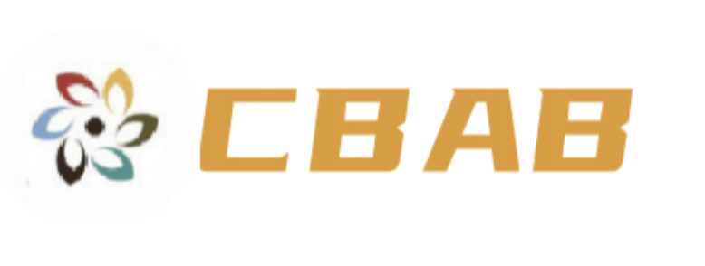

# Our Customers

Lit Protocol is the decentralized network for managing keys and secrets

<figure><figcaption>
<a href="https://www.litprotocol.com/">Lit Protocol</a>
</figcaption></figure>

Megalith Financial Group is a Sydney-based financial institution focused on cross-border payments licensed for both fiat and crypto

<figure><figcaption>
<a href="https://www.linkedin.com/company/megalith-financial-group/">Megalith Financial Group</a>
</figcaption></figure>

China Guangdong-HK-Macao Greater Bay Area Trade Development Promotion Association LIMITED (CBAB)

<figure><figcaption>
<a href="https://www.bayarea.gov.hk/">CBAB</a>
</figcaption></figure>

***


We will update here when new advisors, investors and partners join.

