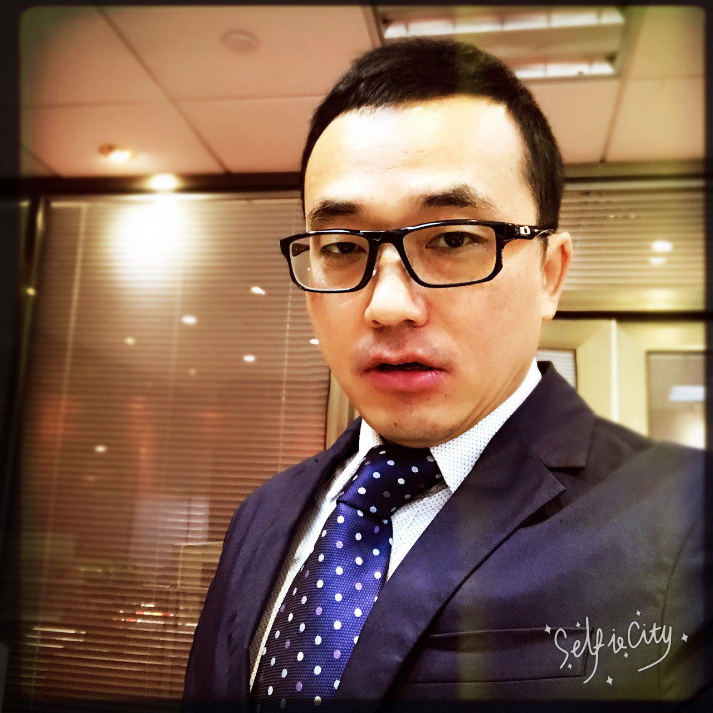

# Our Team

<figure><figcaption></figcaption></figure>

[**Johnny**](https://www.linkedin.com/in/johnnyjiang1/) **(Founder & CEO)**

* Top early Trust Wallet contributor, a visionary crypto wallet builder.&#x20;
* Serial founder bridging web2 and web3 in Australia.
* Angel investor and relentless web3 innovator, still coding and building in the space.&#x20;
* Founding engineering lead at a groundbreaking Sydney fintech startup which secured $1.5M in seed funding.

<figure><figcaption></figcaption></figure>

[**Clara**](https://www.linkedin.com/in/clara-chou-6478ab13b/) **(Cofounder & CPO)**

* Former Product Design Lead at OKX and Alibaba.
* With expertise spanning crypto, e-commerce, and software innovation.&#x20;
* Passionate AI community builder in Singapore, driving connections and innovation at the intersection of technology and design.

***

**Chief of Business for Asia-Pacific**

<figure><figcaption>
Andy Zhow
</figcaption></figure>

* Director of China Guangdong-HK-Macao Greater Bay Area Trade Development Promotion Association LIMITED (HK)

**Chief of Business for Middle-East**

<figure><figcaption>
<a href="https://www.linkedin.com/in/ahmeddewidar/">Ahmed Dewidar</a>
</figcaption></figure>

* Ex MoneyGram
